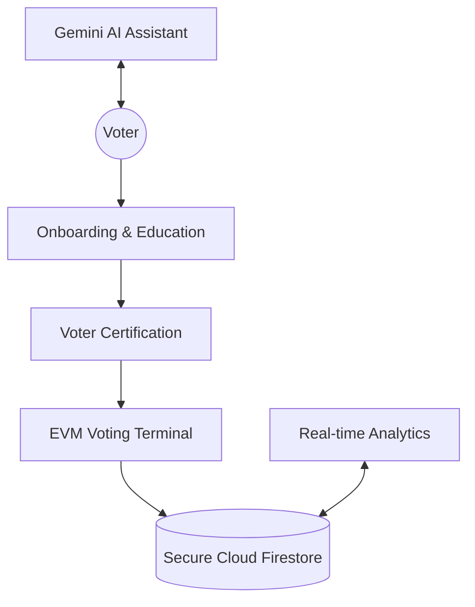

# 🗳️ VoterConnect: Digital Electoral Ecosystem

[](https://nextjs.org/)
[](https://reactjs.org/)
[](https://www.typescriptlang.org/)
[](https://firebase.google.com/)
[](https://opensource.org/licenses/MIT)
[](https://election-assistant-662215332724.us-central1.run.app/)

**Live Demo:** [election-assistant.run.app](https://election-assistant-662215332724.us-central1.run.app/)


---

## 🏛️ Theory & Project Philosophy

VoterConnect is built on the intersection of **Civic Tech** and **Trust Engineering**. Our project addresses the fundamental paradox of digital democracy: *How to ensure absolute privacy while maintaining public transparency.*

### 1. The Theory of Systematic Trust
In traditional elections, trust is placed in human officials. In VoterConnect, trust is shifted to **mathematical verification**. By utilizing cryptographic hashing, the project demonstrates how a "Trustless System" (where you don't need to know the operator to trust the result) can be applied to democratic processes.

### 2. Behavioral Design in Elections
The theory of **Nudge Architecture** is applied here. By providing an "Interactive Roadmap" and "Candidate Manifestos" before the voting terminal, the system nudges users to become informed *before* they act. The goal is to move the user from "Passive Voter" to "Engaged Citizen."

### 3. The Transparency Paradox
We believe that transparency shouldn't compromise anonymity. The project utilizes a **Decoupled Data Architecture** where the identity of the voter (Auth) is strictly separated from the ballot choice (Vote) at the moment of ingestion, ensuring that even a database leak cannot link a specific person to a specific candidate.

---

## 🧩 Core Modules: An In-Depth Look

### 🛡️ 1. The Education & Certification Suite
This is the "Empowerment" engine. Instead of assuming the voter knows the process, this module uses **Gamification Theory** to teach electoral literacy.
*   **Literacy Quizzes**: Interactive assessments that challenge the user's understanding of digital security and voting rights.
*   **Credentialing**: Successful completion issues a digital "Voter Badge," which acts as a psychological incentive (Proof of Competence) before accessing the live terminal.

### 🗳️ 2. The High-Fidelity EVM Simulation
This is the core "Action" module. It is a state-driven component that mirrors a physical Electronic Voting Machine.
*   **State Immutability**: Built with strict React 19 state management, the terminal "locks" once a selection is made, preventing race conditions or double-voting.
*   **Confirmation Barriers**: Implements the "Dual-Check" theory to prevent accidental clicks, ensuring every vote is a conscious, intended action.
*   **VVPAT Receipt**: Generates a digital audit trail that the user can verify without revealing their candidate choice.

### 🤖 3. The AI "Cognitive Bridge" (Assistant)
Powered by **Google Gemini**, this module acts as a bridge between complex electoral law and the everyday citizen.
*   **Natural Language Processing**: Converts legal jargon from election manifestos into simple, conversational text.
*   **Multilingual Intelligence**: Dynamically translates assistance into Hindi, Gujarati, and Telugu, ensuring the "Digital Divide" is bridged for non-English speakers.
*   **Hybrid Knowledge Base**: Uses a local Python-based fallback system to ensure critical process information is available even if AI services are throttled.

### 📊 4. The Real-Time Accountability Dashboard
This module handles the "Transparency" phase of the election lifecycle.
*   **Dynamic Data Stream**: Connects directly to Firestore Listeners to provide second-by-second updates on turnout statistics.
*   **Demographic Heatmaps**: Visualizes participation patterns (age, region, time) using ApexCharts, allowing authorities to identify low-turnout areas in real-time.
*   **Anonymized Aggregation**: Uses server-side aggregation to tally results without ever exposing individual-level data.

---

## 🗺️ System Architecture



---

## 🔒 Security Architecture


*   **AES-256 Client-Side Encryption**: Ensures data is "Dark" before it leaves the browser.
*   **Firebase Guardrails**: Strict Security Rules prevent any user from writing more than once to the vote collection.
*   **Audit Logging**: Every system interaction is logged for post-election forensic analysis.

## ☁️ Deployment & Infrastructure

The project is optimized for **Google Cloud Run** using a high-performance containerization strategy.

### 1. The Multi-Stage Docker Theory
We use a **Three-Stage Docker Build** to ensure the production image is as lean as possible:
*   **Deps Stage**: Installs only the required dependencies using `npm ci`.
*   **Builder Stage**: Compiles the TypeScript code into an optimized Next.js standalone bundle.
*   **Runner Stage**: A minimal runtime environment that only contains the `standalone` output, reducing the image size by up to 80%.

### 2. Environment Variables & Build-Time Logic
Next.js bakes `NEXT_PUBLIC_` variables into the JavaScript bundle during the `build` phase. To deploy successfully:
*   **Build-Time Vars**: Ensure your CI/CD (Cloud Build) has access to the Firebase API keys during the `npm run build` step.
*   **Runtime Vars**: Sensitive keys (like `GOOGLE_GEMINI_API_KEY`) can be injected as Cloud Run Secrets.

### 🚀 Deploying to Cloud Run

If your build fails, ensure you have a `.dockerignore` file to prevent local `node_modules` from interfering with the remote Linux build.

```bash
# Standard Deployment Command
gcloud run deploy election-assistant \
  --source . \
  --region us-central1 \
  --allow-unauthenticated \
  --clear-base-image
```

### 🛠️ Troubleshooting Deployment

If you encounter the following common errors:

#### 1. "Unsupported engine" (Next.js 15/16)
Next.js 15+ and 16 require **Node.js 20.9.0 or higher**. If your build fails with an `EBADENGINE` error, ensure your `Dockerfile` starts with:
```dockerfile
FROM node:20-slim
```
*VoterConnect is already pre-configured with a Node 20 multi-stage build.*

#### 2. "Missing required argument [--clear-base-image]"
This happens when you redeploy a service that was originally built with a different method. Always include the flag:
```bash
--clear-base-image
```

#### 3. "TypeError: expected string... got NoneType"
This is a rare `gcloud` CLI error that usually occurs when the build fails prematurely. Fixing the Node version in the `Dockerfile` and ensuring `.dockerignore` exists will resolve the root cause.

---

## 🛠️ Getting Started

### Installation
```bash
git clone https://github.com/Dhruvisha-Bhaliya/Election-assistent.git
npm install
npm run dev
```

---
*Built with ❤️ to empower every voice and modernize democracy through technology.*
